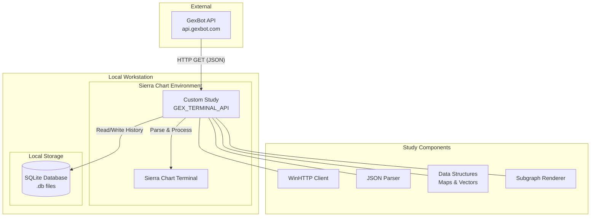

# SierraChart GexBot Terminal API

This project contains a custom C++ study for **Sierra Chart** that integrates with the **GexBot API**. It is designed to fetch, process, and visualize real-time and historical Gamma Exposure (GEX) data directly on your trading charts.

## Features

*   **Real-time API Integration**: Fetches Majors, Profile, and Greeks data from `api.gexbot.com` using WinHTTP.
*   **Local Data Caching**: Uses **SQLite** to store historical data locally, enabling fast retrieval and "forward fill" logic for days without immediate API data.
*   **Comprehensive Visualization**: Plots key metrics as subgraphs:
    *   Zero Gamma Levels
    *   Major Positive/Negative Vol & OI
    *   Long/Short Gamma
    *   Greeks (Major Positive/Negative)
*   **Customizable**: User inputs for API Key, Ticker, Refresh Intervals, and Database Paths.

## Architecture

The following diagram illustrates the high-level architecture of the system:

## Setup & Usage

1.  **Compile**: Use the Sierra Chart C++ compiler to build the `scriptgexbotmarketterminal.txt` (rename to `.cpp` if needed).
2.  **Add to Chart**: Add the **GEX BOT API** study to your chart.
3.  **Configuration**:
    *   **API Key**: Enter your valid GexBot API key.
    *   **Ticker**: Specify the ticker (e.g., `ES_SPX`).
    *   **Database Paths**: Set valid local paths for reading/writing the SQLite database.
