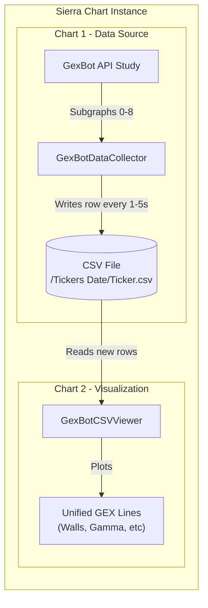

# SierraCharts GexBot Integration

This project provides a robust integration between GexBot data and Sierra Chart, enabling real-time recording, storage, and visualization of Gamma Exposure (GEX) data.

## 🏗️ Architecture

The system consists of two independent studies (DLLs) that work in a **Producer-Consumer** relationship.

### 1. Producer: `GexBotDataCollector`
*   **Role:** Runs on the chart that has the GexBot API connected.
*   **Function:** Reads the subgraph data from the GexBot API study, formats it, and writes it to a local CSV file.
*   **Format:** Creates daily files automatically (e.g., `Tickers 02.09.2026/ES_SPX.csv`).
*   **Performance:** Lightweight write operation throttled to a user-defined interval (default 10s, recommended 1-5s for high res).
*   **Timestamps:** Uses real-time wall clock for sub-bar resolution.
*   **Robustness:** Includes file locking protection and smart Spot Price detection (Auto-detects Price vs Volume bars).

### 2. Consumer: `GexBotCSVViewer`
*   **Role:** Runs on **any** chart where you want to view the history.
*   **Function:** Reads the CSV files created by the Collector and plots them as historical subgraphs.
*   **Integration:** Can be used on 1-minute, 5-minute, or any other timeframe charts.
*   **Optimization:** Uses **Incremental Reading** technology. It tracks the file size and only reads new data appended since the last check, ensuring O(1) performance even with large datasets.
*   **Smart Rendering:** 
    *   Forward-fills data indefinitely (no disappearing lines).
    *   **Time Filter:** Only draws lines during market hours (09:30 - 16:00) to prevent flat lines overnight.
    *   **Auto-Hide:** Hides "State Package" subgraphs by default to prevent Y-axis scaling issues for Classic users.

## 🚀 Setup & Installation

### 1. Prerequisite
Ensure you have the GexBot API study installed and working on a chart in Sierra Chart.

### 2. Compilation
1.  Open Sierra Chart.
2.  Go to **Analysis** -> **Build Custom Studies DLL**.
3.  Select the following files:
    *   `GexBotDataCollector.cpp`
    *   `GexBotCSVViewer.cpp`
4.  Click **Build**.
5.  Wait for the "Remote build is complete" message.

### 3. Usage Guide

#### Step A: Setup the Collector (The "Recorder")
1.  Open the chart that has the GexBot API running.
2.  Go to **Analysis** -> **Studies**.
3.  Add **`GexBot Data Collector`**.
4.  Open the **Settings** for the study:
    *   **Source Chart ID:** Set to `0` if it's the same chart, or the ID of the chart with GexBot API.
    *   **Source Study ID:** The ID of the GexBot API study on that chart.
    *   **Ticker Name:** `ES_SPX` (or your specific ticker).
    *   **Output Directory:** `C:\GexBot\Data` (Ensure this folder exists or let the study create it).
    *   **Write Interval:** `5` seconds (Recommended for high resolution).

#### Step B: Setup the Viewer (The "Player")
1.  Open any chart where you want to see the data (e.g., a 5-minute ES chart).
2.  Go to **Analysis** -> **Studies**.
3.  Add **`GexBot CSV Viewer`**.
4.  Open the **Settings**:
    *   **Ticker:** Must match what you set in the Collector (e.g., `ES_SPX`).
    *   **Local CSV Path:** Must match the Collector's output path (`C:\GexBot\Data`).
    *   **Days to Load:** `2` (Loads today and yesterday). Increase this if you need more history (e.g., `30` for a month).
    *   **Refresh Interval:** `5` seconds (Should match the Collector).

## 🎛️ Configuration Options

### GexBot Data Collector
| Input Name | Description | Default |
| :--- | :--- | :--- |
| **Source Chart ID** | The ID of the chart hosting the GexBot API study. Use `0` for "Current Chart". | `0` |
| **Source Study ID** | The unique ID of the GexBot API study (found in the Studies list). | `0` |
| **Ticker Name** | The name used for the CSV filename. | `ES_SPX` |
| **Output Directory** | The base folder where daily subfolders will be created. | `C:\GexBot\Data` |
| **Market Start/End** | Time filter to only record during specific hours. | `09:30:00` - `16:00:00` |
| **Write Interval** | How often to save data to the CSV. Lower = more resolution, Higher = less disk usage. | `10s` |

### GexBot CSV Viewer
| Input Name | Description | Default |
| :--- | :--- | :--- |
| **Ticker** | Name of the ticker file to look for. | `ES_SPX` |
| **Local CSV Path** | Base folder to search for data. | `C:\GexBot\Data` |
| **Refresh Interval** | How often to check the file for new data. | `10s` |
| **Days to Load** | Number of past days to load into history. | `2` |
| **Chart Timezone (UTC Offset)** | Your Sierra Chart timezone setting as UTC offset. | `0` |

> ⚠️ **Chart Timezone Setup:** This value must match your Sierra Chart timezone setting (Global Settings → General → Time Zone).
> - If Sierra Chart is **UTC** → set to `0`
> - If Sierra Chart is **US Eastern (EST)** → set to `-5`
> - If Sierra Chart is **US Central (CST)** → set to `-6`
>
> This controls two things: (1) how CSV timestamps are converted to chart time, and (2) the market hours filter (09:30-16:00 EST adjusted to your chart's timezone).

## 📊 Subgraph Mapping

### GexBot API Study (Source DLL: `scsf_GexBotAPI`)
The source DLL defines **13 subgraphs** in the following order. The Collector reads from indices `[0], [1], [4]-[8]`:

| Index | Variable Name | Data Source | Collector Reads? |
| :---: | :--- | :--- | :---: |
| **[0]** | LongGamma | `Greeks.major_long_gamma` | ✅ → Long |
| **[1]** | ShortGamma | `Greeks.major_short_gamma` | ✅ → Short |
| **[2]** | MajorPositive | `Greeks.major_positive` | ❌ (Greek) |
| **[3]** | MajorNegative | `Greeks.major_negative` | ❌ (Greek) |
| **[4]** | Zero | `ProfileMeta.zero_gamma` | ✅ → Zero |
| **[5]** | MajorPosVol | `Majors.mpos_vol` | ✅ → Call Wall (Vol) |
| **[6]** | MajorNegVol | `Majors.mneg_vol` | ✅ → Put Wall (Vol) |
| **[7]** | MajorPosOi | `Majors.mpos_oi` | ✅ → Call Wall (OI) |
| **[8]** | MajorNegOi | `Majors.mneg_oi` | ✅ → Put Wall (OI) |
| **[9]** | GreekMajorPos | *(duplicate of [2])* | ❌ |
| **[10]** | GreekMajorNeg | *(duplicate of [3])* | ❌ |
| **[11]** | MajorLongGamma | *(duplicate of [0])* | ❌ |
| **[12]** | MajorShortGamma | *(duplicate of [1])* | ❌ |

> **Note:** Net GEX (Vol/OI) are **not subgraphs** — they are computed internally and written to CSV by the API study's `UpdateMapsAndWriteCSV` function.

### CSV Viewer (Output)
The Viewer plots the following subgraphs on your chart:

| Subgraph | Name | Notes |
| :---: | :--- | :--- |
| **SG1** | Major Call Gamma (Vol) | Price level line |
| **SG2** | Major Put Gamma (Vol) | Price level line |
| **SG3** | Zero Gamma | Price level line |
| **SG4** | Major Call Gamma (OI) | Price level line |
| **SG5** | Major Put Gamma (OI) | Price level line |
| **SG6** | Major Long Gamma | *(State Package)* Hidden by default |
| **SG7** | Major Short Gamma | *(State Package)* Hidden by default |
| **SG8** | Net GEX (Vol) | Hidden by default (different scale) |
| **SG9** | Net GEX (OI) | Hidden by default (different scale) |

## 🧩 Advanced: Dual Package Setup
If you need to view both **Classic** and **State** data packages simultaneously, you should run two separate data streams:

1.  **Collector A:** Point to GexBot Classic study -> Ticker Name: `ES_CLASSIC`
2.  **Collector B:** Point to GexBot State study -> Ticker Name: `ES_STATE`
3.  **Viewers:** Add two Viewer studies to your chart, one loading `ES_CLASSIC` and one loading `ES_STATE`.

## ⚠️ Y-Axis Scaling Tips

The GEX data contains values on **very different scales**:
*   **Price Levels** (Zero Gamma, Call/Put Walls): ~5000-7000 for ES
*   **Net GEX Values**: Can be in the millions (e.g., 15,000,000)

If you enable all subgraphs at once, the Y-axis may "freak out" trying to fit everything.

### Recommendations:
1.  **Keep Net GEX subgraphs hidden** (they are hidden by default) if you only care about price levels.
2.  **Use a separate Graph Region** for Net GEX:
    *   In the Viewer study settings, set SG8/SG9 to a different Graph Region (e.g., Region 2).
3.  **Use Manual Scale** if Auto Scale causes issues.
