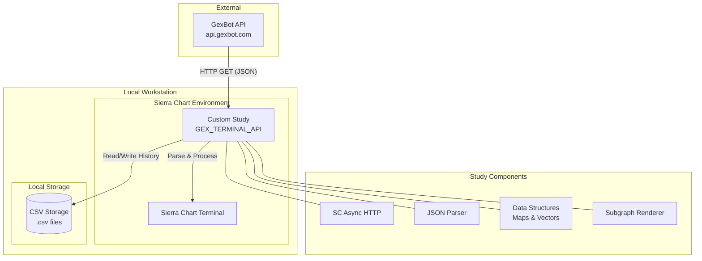

# SierraChart GexBot Terminal API

This project contains a custom C++ study for **Sierra Chart** that integrates with the **GexBot API**. It is designed to fetch, process, and visualize real-time and historical Gamma Exposure (GEX) data directly on your trading charts.

## Features

*   **Real-time API Integration**: Fetches Majors, Profile, and Greeks data from `api.gexbot.com` using Sierra Chart's Async HTTP.
*   **Local Data Caching**: Uses **CSV Files** to store historical data locally, enabling fast retrieval and "forward fill" logic for days without immediate API data.
*   **Comprehensive Visualization**: Plots key metrics as subgraphs:
    *   Zero Gamma Levels
    *   Major Positive/Negative Vol & OI
    *   Long/Short Gamma
    *   Greeks (Major Positive/Negative)
*   **Customizable**: User inputs for API Key, Ticker, Refresh Intervals, and Database Paths.

## Architecture

The following diagram illustrates the high-level architecture of the system:

## Setup & Usage

1.  **Compile**: Use the Sierra Chart C++ compiler to build `GexBotTerminalAPI.cpp`.
2.  **Add to Chart**: Add the **GEX BOT API** study to your chart.
3.  **Configuration**:
    *   **API Key**: Enter your valid GexBot API key.
    *   **Ticker**: Specify the ticker (e.g., `ES_SPX`).
    *   **CSV Paths**: Set valid local paths for reading/writing the CSV files (e.g., `C:\GexBot\Data`).

## Proposed Subgraph Mapping & CSV Structure

The following mapping is planned for future updates to align the CSV output and Subgraphs with the default GEXBOT API DLL standards:

| SG Index (UI) | Subgraph Name (Label) | Description |
| :--- | :--- | :--- |
| **SG1** | Major Call Gamma by Volume | Major Positive Gamma Level (derived from Volume) |
| **SG2** | Major Put Gamma by Volume | Major Negative Gamma Level (derived from Volume) |
| **SG3** | Zero Gamma | Zero Gamma Level |
| **SG4** | Major Call Gamma by OI | Major Positive Gamma Level (derived from OI) |
| **SG5** | Major Put Gamma by OI | Major Negative Gamma Level (derived from OI) |
| **SG6** | Major Long Gamma | Major Long Gamma Level |
| **SG7** | Major Short Gamma | Major Short Gamma Level |
| **SG8** | Net GEX Volume | Net Gamma Exposure (Volume) |
| **SG9** | Net GEX OI | Net Gamma Exposure (Open Interest) |

